# canopen-rs Architecture

A tour of the `canopen-rs` codebase for engineers who want to understand it and
contribute. It is written from a reading of the source, not from generic CANopen
knowledge; every type, method, and constant named here exists in the tree, and
the file path where it lives is cited so you can jump straight to it.

`canopen-rs` is a **`no_std`-first CANopen (CiA 301) protocol stack** with a
matching **`std` host layer**. Its defining property is that the protocol logic
is **sans-I/O**: state machines consume decoded frames and produce frames to
send, but never touch a bus. The identical core runs on a bare-metal
microcontroller (`thumbv7em-none-eabihf`) and on a Linux host over SocketCAN.

## Table of contents

1. [System context and crate layering](#1-system-context-and-crate-layering)
2. [Core module map](#2-core-module-map)
3. [Sans-I/O data flow](#3-sans-io-data-flow)
4. [Object dictionary](#4-object-dictionary)
5. [SDO — Service Data Objects](#5-sdo--service-data-objects)
6. [NMT — Network Management](#6-nmt--network-management)
7. [PDO — Process Data Objects](#7-pdo--process-data-objects)
8. [LSS and Fastscan](#8-lss-and-fastscan)
9. [Host transports](#9-host-transports)
10. [Testing and validation strategy](#10-testing-and-validation-strategy)
11. [Where to start reading](#11-where-to-start-reading)

---

## 1. System context and crate layering

The workspace (`Cargo.toml`) has three member crates:

| Crate | Path | `std`? | Role |
|-------|------|--------|------|
| `canopen-rs` | `core/` | `#![no_std]`, `#![deny(unsafe_code)]` | Transport-agnostic, allocation-free protocol core |
| `canopen-host` | `host/` | `std` | Linux SocketCAN transport (blocking + async) and EDS parsing |
| `canopen-cli` | `cli/` | `std` | The `canopen` binary (eds/codegen/read/write/nmt/monitor) |

The hinge between "protocol" and "bus" is the [`embedded-can`](https://docs.rs/embedded-can)
trait family. The core speaks only in **COB-IDs** (11-bit CAN identifiers) and
8-byte payloads; `core/src/transport.rs` bridges those to `embedded_can::Frame`
via two free functions, `frame_from` and `cob_id`. Anything that implements
`embedded_can::Frame` — a HAL driver or the host's `socketcan::CanFrame` — can
therefore carry CANopen traffic unchanged.

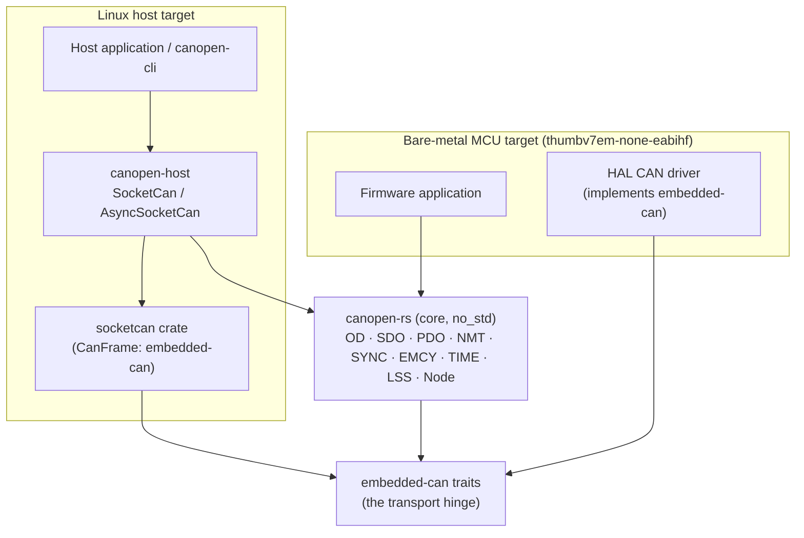

### The no_std / std split and feature flags

- **`core/Cargo.toml`** depends only on `embedded-can` (0.4) and `heapless`
  (0.8). Its one feature is `std` (default off), which merely adds a
  `std::error::Error` impl for the crate's `Error` type (`core/src/types.rs`);
  the design rule stated in the manifest is that `std` "must never be required
  by the core protocol logic."
- **`host/Cargo.toml`** always compiles `eds`, `codegen`, and `nmt`
  (cross-platform), but gates the SocketCAN transport behind
  `#[cfg(target_os = "linux")]` (see `host/src/lib.rs`) because SocketCAN is a
  Linux kernel interface. `socketcan` and `embedded-can` are pulled in only on
  Linux.
- The **`tokio` feature** on `canopen-host` adds `async_transport` (also
  Linux-only), built on `socketcan/tokio`.
- **`cli`** depends on both core and host plus `clap` and `anyhow`. On non-Linux
  it degrades to just `canopen eds` / `canopen codegen`; the bus subcommands
  `bail!` with a message (`cli/src/main.rs`, the `NOT_LINUX` stubs).

MSRV is Rust 1.75 (edition 2021), set once in `[workspace.package]`.

---

## 2. Core module map

Every public module lives directly under `core/src/`. `types.rs` (the `Error`,
`Result`, `NodeId` foundations) and `datatypes.rs` (the `DataType` / `Value`
codec) sit at the bottom; `node.rs` is the integrator that pulls the protocol
modules together into a runnable device. Arrows point from a module to what it
depends on (`use crate::…`).

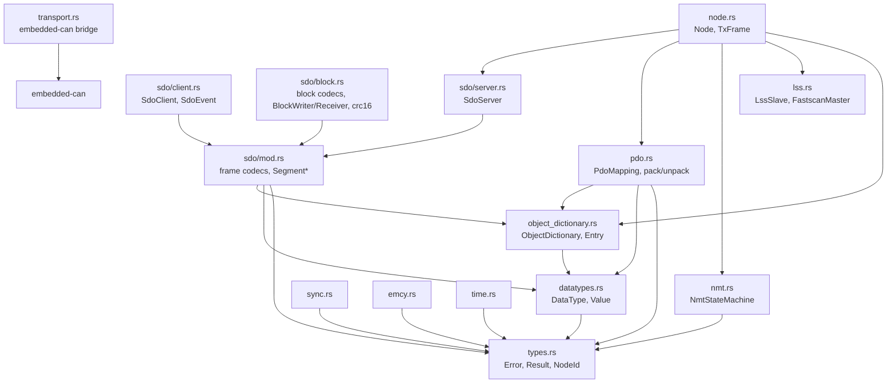

Notes worth knowing before you read:

- **`lss.rs` is self-contained** — it imports nothing from `crate::`, defining
  its own frame layout and returning `Option`/`Result<(), u8>` directly. `Node`
  is what wires it into the rest.
- **`transport.rs` depends only on `embedded_can`**, not on any protocol module.
  It is a pure adapter.
- **`sdo/block.rs` is codec-and-helper only.** Unlike expedited/segmented
  transfer, block transfer is **not** driven by `SdoServer`/`SdoClient` or
  `Node`; you drive it yourself with the free functions plus `BlockWriter` /
  `BlockReceiver` (see [§5](#5-sdo--service-data-objects) and the discrepancy
  note there).

---

## 3. Sans-I/O data flow

The core never performs I/O. The contract is: **hand it a received frame, get
back an optional frame to transmit.** For a whole device that contract is
`Node::on_frame` (`core/src/node.rs`):

```rust
pub fn on_frame(&mut self, cob_id: u16, data: &[u8]) -> Option<TxFrame>
```

`TxFrame` (`core/src/node.rs`) is a small value type: a `cob_id: u16` and up to
eight `data()` bytes. The host or firmware supplies the I/O around it. The
blocking host loop, for example, is literally:

```rust
let boot = node.boot();
bus.send(boot.cob_id, boot.data());
loop {
    let (cob_id, data) = /* read a frame from the bus */;
    if let Some(tx) = node.on_frame(cob_id, &data) {
        bus.send(tx.cob_id, tx.data());
    }
}
```

### Dispatch inside `Node::on_frame`

The order of checks matters — LSS is served first and unconditionally, and an
unconfigured node is gated to LSS only:

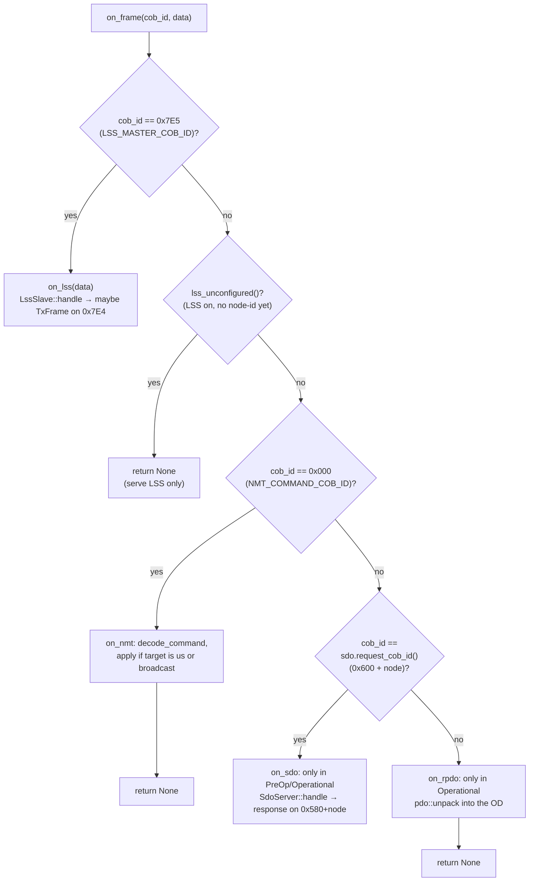

State gating (all per CiA 301, enforced in `node.rs`):

- **NMT node-control** (`0x000`) is applied only if the command's target is this
  node's id or `NodeId::BROADCAST`.
- **SDO** (`0x600 + node`) is served only in `PreOperational` or `Operational`.
- **RPDOs** are unpacked only in `Operational`.
- **LSS** is served regardless of NMT state — but while the node is
  *unconfigured* (`enable_lss_unconfigured`), `on_frame` serves **only** LSS and
  ignores everything else, because its data COB-IDs are not yet meaningful.

Note what `on_frame` deliberately does **not** handle: **SYNC** (`0x080`) and the
producer objects. SYNC-triggered transmission is a separate pull API —
`Node::sync_tpdos()` returns the TPDOs to emit — that the surrounding loop calls
when it observes a SYNC frame. Likewise `Node::boot()`, `Node::heartbeat()`, and
`Node::node_guard_response()` are producer calls the loop makes on its own
schedule. Emergencies are producer-initiated the same way: `Node::raise_emergency`
and `Node::clear_errors` update the error register (`0x1001`) and pre-defined
error field (`0x1003`) — mirroring both into the OD so a master can read them over
SDO — and **return** the EMCY frame for the loop to transmit; they are not a
response to an inbound frame, so they live outside `on_frame`. TIME remains a
standalone codec (`time.rs`) the application uses directly.

---

## 4. Object dictionary

The object dictionary (`core/src/object_dictionary.rs`) is the device's data
model: objects addressed by a 16-bit index and 8-bit subindex.

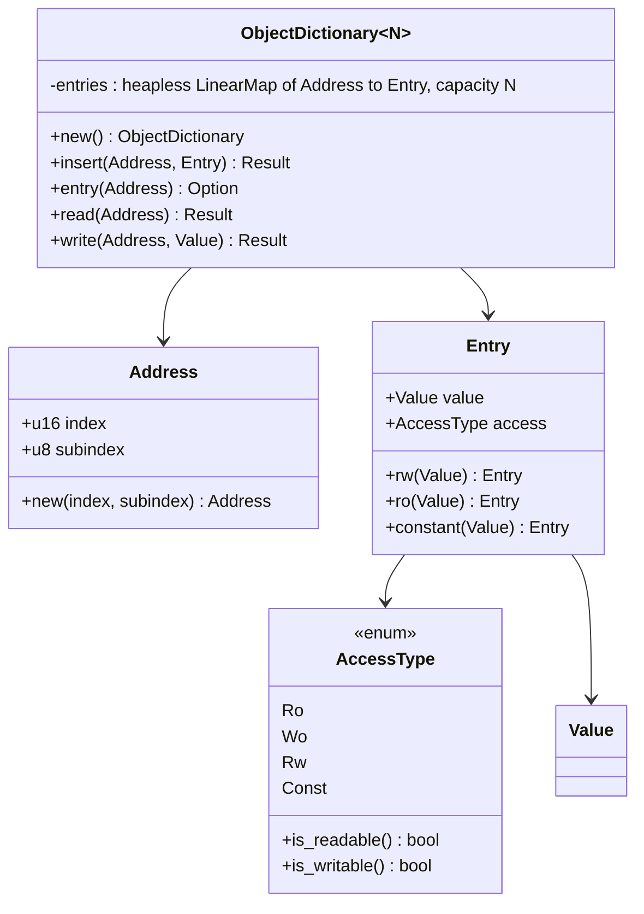

Key facts:

- **Backing store**: `heapless::LinearMap<Address, Entry, N>` — a fixed capacity
  `N` chosen at the type level (`ObjectDictionary::<16>::new()`), no allocator.
  `insert` returns `Error::DictionaryFull` when full.
- **Access control is enforced on every access.** `read` returns
  `Error::WriteOnly` for a non-readable object; `write` returns `Error::ReadOnly`
  for a non-writable one and `Error::TypeMismatch` if the new `Value`'s
  `data_type()` differs from the stored object's — the object's type is fixed by
  whatever `Value` variant was inserted. `Const` is readable but not writable.
- **`entry()`** bypasses access checks to borrow the raw `Entry` (used internally
  by the SDO server to learn an object's type before deciding how to respond).

### Data types and the value codec

`core/src/datatypes.rs` models the CiA 301 numeric basic types as
`DataType` (discriminant = the CiA data-type index, e.g. `Unsigned32 = 0x07`)
and typed values as `Value`. CANopen is little-endian on the wire; `Value` does
the conversion:

- `Value::encode_le(&mut buf) -> Result<usize>` writes little-endian, returns
  the byte count, errors `BadLength` on a short buffer.
- `Value::decode_le(DataType, &bytes) -> Result<Value>` requires `bytes.len()`
  to equal `DataType::fixed_size()` for a fixed type, or be within
  `MAX_STRING_LEN` for a variable-length one.
- Both `enum`s are `#[non_exhaustive]`. Alongside the numeric types,
  `VISIBLE_STRING`, `OCTET_STRING`, and `DOMAIN` are modelled by a bounded,
  `Copy` `ByteString` (up to `MAX_STRING_LEN` bytes). `DataType::fixed_size()`
  returns `None` for these variable-length types; the SDO server/client size
  their segmented-transfer buffers to `MAX_STRING_LEN`, and the EDS parser reads
  string default values.

### Building an OD from an EDS

`canopen_host::eds::Eds` (`host/src/eds.rs`) parses an EDS/DCF file into
`ObjectDescription`s and `Eds::object_dictionary::<N>()` produces exactly this
`ObjectDictionary` type. `canopen_host::codegen::generate_object_dictionary`
(`host/src/codegen.rs`) instead emits **Rust source** for a
`pub fn …() -> canopen_rs::ObjectDictionary<N>` — a `build.rs` turns a device
file into a compile-time, zero-runtime-parse OD. See [§9](#9-host-transports).

### The mandatory-object baseline

`canopen_rs::standard::StandardObjects` (`core/src/standard.rs`) inserts the
mandatory CiA 301 communication-profile objects — device type (`0x1000`), error
register (`0x1001`), heartbeat time (`0x1017`), identity record (`0x1018`), and
an optional pre-defined error field (`0x1003`) — in one builder call. The
identity is the same `LssAddress` LSS matches (§8) and the error objects are the
ones `Node::raise_emergency` mirrors into (§6), so it is the common seam between
those subsystems. All the objects it writes are node-id-independent, so it can
populate an LSS-unconfigured node before an id is assigned.

---

## 5. SDO — Service Data Objects

SDO gives confirmed, addressed read/write access to any OD entry over a request
channel (`0x600 + node`) and a response channel (`0x580 + node`). The layering
in `core/src/sdo/` is:

- **`mod.rs`** — the raw 8-byte frame codecs (`encode_*` / `decode_*`), command
  specifiers, `SdoAbortCode`, and the `SegmentWriter` / `SegmentReader`
  reassembly helpers.
- **`server.rs`** — `SdoServer`, a sans-I/O state machine that services requests
  against an `ObjectDictionary`.
- **`client.rs`** — `SdoClient`, which drives read/write transactions and emits
  an `SdoEvent` (`Send`/`Complete`/`Aborted`) per response.
- **`block.rs`** — the block-transfer codecs, `crc16`, and `BlockWriter` /
  `BlockReceiver`.

`SdoClient` chooses the transfer mode automatically from the value size (≤ 4
bytes → expedited, > 4 → segmented). The server does the same when responding to
a read.

### 5a. Expedited transfer (value fits in ≤ 4 bytes)

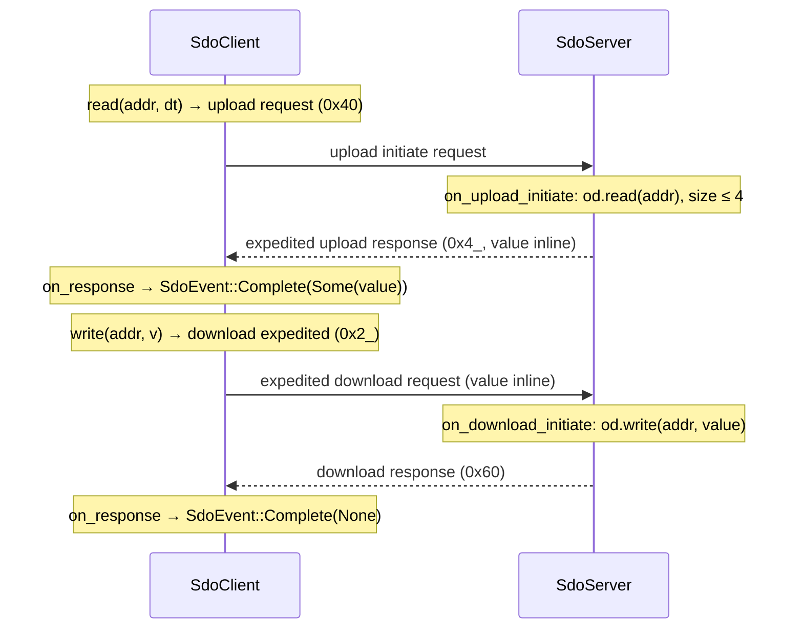

If the object is missing or access is denied, the server replies with an **abort
frame** (`encode_abort`) carrying a standard `SdoAbortCode` — e.g.
`ObjectDoesNotExist` (`0x0602_0000`), `WriteOfReadOnly` (`0x0601_0002`),
`ReadOfWriteOnly` (`0x0601_0001`), `DataTypeMismatchLengthHigh`/`Low`. The client
treats any decodable abort uniformly and returns `SdoEvent::Aborted(code)`.

### 5b. Segmented transfer (value is 5–8 bytes, e.g. `UNSIGNED64`)

An *initiate* exchange declares the total byte count, then a run of *segment*
frames each carry up to seven bytes. A per-transfer **toggle** bit alternates
from `false` on every segment; the final data segment sets the "no more
segments" bit. The server holds the in-progress transfer in its `Transfer` enum
(`Upload`/`Download`) between calls.

Segmented **upload** (client reads a large value):

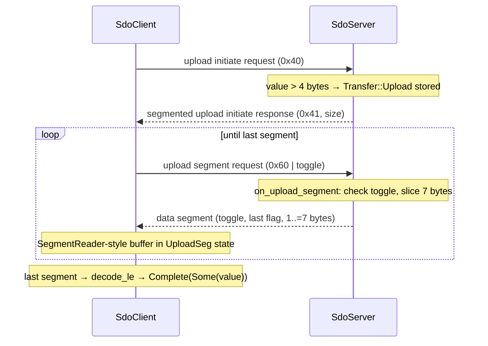

Segmented **download** (client writes a large value) mirrors it: client sends
`encode_download_initiate_segmented(addr, size)`, the server stores
`Transfer::Download` and acks with a download response, then the client streams
data segments and the server acks each with `encode_download_segment_response`.
On the final segment the server checks `buf.len() == declared`, decodes, and
writes the OD (`DataTypeMismatchLengthLow` if the count is short). A **toggle out
of sequence** aborts with `ToggleBitNotAlternated`.

A client **abort** during a segmented transfer is unconfirmed: `SdoServer::handle`
returns `None` (no reply) and clears its `transfer` state.

### 5c. Block transfer (high-throughput bulk transfer)

Block transfer streams a whole *sub-block* of up to `MAX_BLKSIZE` (127) segments
before a single acknowledgement, then verifies with CRC-16/XMODEM (`crc16`,
polynomial `0x1021`, init `0`). `block.rs` implements both directions as codecs
plus two happy-path helpers:

- **`BlockWriter`** — splits a byte buffer into sub-block segments
  (`next_segment` until the sub-block is full or data is exhausted;
  `start_sub_block(blksize)` for the next; `end_frame(crc_support)` at the end).
  Used by the download client and the upload server.
- **`BlockReceiver<N>`** — reassembles segments (`push`), then `finish(unused,
  crc, verify_crc)` trims the last segment's unused tail and checks the CRC,
  returning `Error::CrcMismatch` on failure. Used by the download server and the
  upload client.

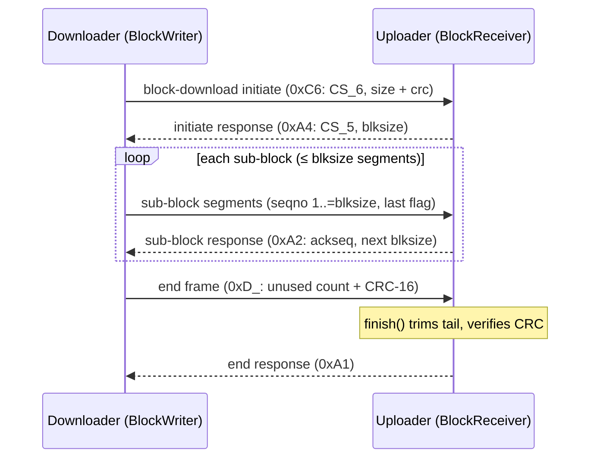

> **Discrepancy / nuance to know:** the README's feature table marks "SDO block
> transfer (download + upload, CRC-16)" as done, and it is — as **codecs and
> helpers**. But block transfer is **not** wired into the `SdoServer`/`SdoClient`
> state machines or `Node::on_frame`. `Node` serves expedited and segmented SDO
> only. To use block transfer you drive the `block.rs` functions yourself; the
> `vcan_loopback` example does exactly this (it reassembles a 50-byte block
> download in its own frame handler). Contributors wanting block transfer inside
> `Node`/`SdoServer` have a clear, self-contained task.

---

## 6. NMT — Network Management

`core/src/nmt.rs` holds the node lifecycle. `NmtStateMachine` tracks the current
`NmtState`; `NmtCommand`s (decoded from the master's `0x000` frames) drive
transitions. State is reported to the network via a heartbeat producer on
`0x700 + node`, and the discriminants double as the wire values (`Operational =
0x05`, `Stopped = 0x04`, `PreOperational = 0x7F`, `Initialising = 0x00`).

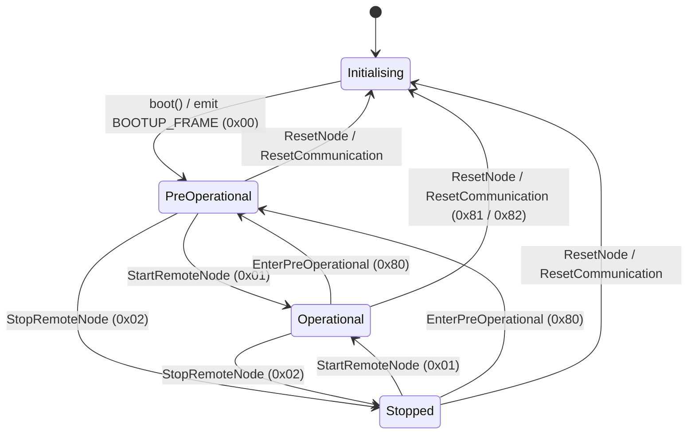

Transition rules, exactly as coded in `NmtStateMachine::apply`:

- **Reset from any state** (`ResetNode` `0x81` or `ResetCommunication` `0x82`)
  returns to `Initialising`.
- **During `Initialising`, operational commands are ignored** — the node leaves
  that state only via `boot()`. `boot()` is a no-op unless currently
  initialising.
- **Repeating a command that matches the current state is a harmless no-op.**

### Error control: heartbeat, boot-up, and node guarding

- `Node::boot()` transitions to `PreOperational` and returns the **boot-up**
  frame (`0x700 + node`, data `0x00`).
- `Node::heartbeat()` returns a frame encoding the current state; the producer
  interval lives in OD object `0x1017`. The host side tracks these with
  `HeartbeatMonitor` ([§9](#9-host-transports)).
- **Node guarding** (CiA 301 §7.3.1), the legacy RTR-based alternative:
  `Node::node_guard_response()` replies to a master's RTR poll with the state
  byte plus an **alternating toggle bit** in bit 7 (`encode_node_guard` /
  `decode_node_guard`). `decode_heartbeat` masks bit 7 so a heartbeat decode is
  unaffected.

---

## 7. PDO — Process Data Objects

PDOs carry mapped process data with no protocol overhead: up to eight bytes laid
out by the mapping parameters. `core/src/pdo.rs` models the mapping and the
pack/unpack; `Node` holds up to `MAX_PDOS` (4) receive and transmit PDO slots
(`RpdoSlot` / `TpdoSlot`).

### Mapping model

A `MappingEntry` references an object (`Address`) and a `bit_length`; on the wire
and in the OD mapping record it is the `u32` `0xIIII_SSLL` (index, subindex, bit
length), via `to_u32()` / `from_u32()`. A `PdoMapping<N>` is an ordered,
capacity-`N` list; `push` rejects a mapping whose total exceeds 64 bits
(`Error::PdoTooLong`).

- **`pack(mapping, od, buf)`** reads each mapped object out of the OD and lays it
  little-endian into `buf` in mapping order (TPDO). Returns the byte length.
- **`unpack(mapping, od, data)`** decodes each field from `data` and writes it
  back into the OD (RPDO), taking each field's type from the object currently
  stored there.

**Scope limit worth noting:** mappings are **byte-aligned only** — `byte_width`
rejects any `bit_length` that is not a non-zero multiple of 8 with
`Error::UnsupportedTransfer`. Sub-byte packing (e.g. several booleans in one
byte) is a documented future addition.

### Predefined connection-set COB-IDs

`default_cob_id(kind, number, node)` yields the CiA 301 defaults for PDO
`1..=4`: TPDOs at `0x180/0x280/0x380/0x480 + node`, RPDOs at
`0x200/0x300/0x400/0x500 + node`. A communication-parameter COB-ID carries a
**validity bit** (bit 31); `pdo_is_valid` and `pdo_can_id` split it out.

### Transmit paths, and configuring from the OD

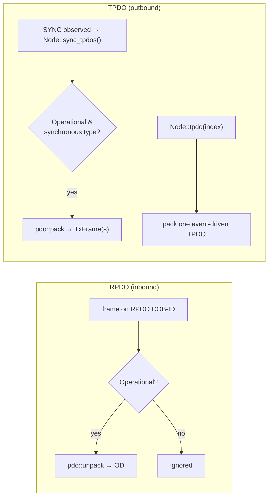

- `TransmissionType` (`from_byte`/`to_byte`) distinguishes `SynchronousAcyclic`
  (0), `SynchronousCyclic(1..=240)`, `SynchronousRtrOnly` (252), and the
  event-driven variants (253/254/255); `241..=251` is reserved and rejected.
- **`Node::sync_tpdos()`** packs and returns every configured TPDO with a
  *synchronous* transmission type — call it when a SYNC (`0x080`) is observed. It
  is empty unless the node is `Operational`.
- **`Node::tpdo(index)`** emits one TPDO on demand (event-driven), also gated to
  `Operational`.
- **`Node::configure_pdos_from_od()`** rebuilds all four RPDO/TPDO slots from the
  standard PDO-parameter objects — communication at `0x1400`+/`0x1800`+ and
  mapping at `0x1600`+/`0x1A00`+ — honouring the COB-ID validity bit. Combined
  with `Node::take_written_object()` (which reports the last object a master
  wrote over SDO), a node can react to a master reconfiguring its PDOs live:
  detect a write in `0x1400..=0x1BFF`, then re-run `configure_pdos_from_od`.

---

## 8. LSS and Fastscan

Layer Setting Services (CiA 305) assign a node-id (and bit timing) over the bus
to a node that ships unconfigured. LSS uses two fixed COB-IDs: master→slave on
`LSS_MASTER_COB_ID` (`0x7E5`) and slave→master on `LSS_SLAVE_COB_ID` (`0x7E4`).
`core/src/lss.rs` provides `LssSlave` (the node-side state machine) and
`FastscanMaster` (a sans-I/O discovery driver), plus the master-side codecs.

### Slave state machine

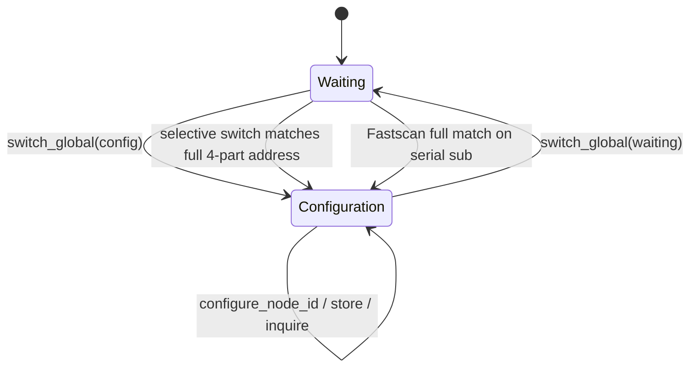

- **Switch global** (`encode_switch_global`) moves every node between `Waiting`
  and `Configuration`.
- **Selective switch** (`encode_switch_selective`) is a four-frame sequence
  (vendor, product, revision, serial). `LssSlave` tracks progress in its
  `selective` counter and enters `Configuration` — replying with
  `CS_SWITCH_SELECTIVE_RESPONSE` — only on a full match of all four values of its
  `LssAddress` (the `0x1018` identity).
- In `Configuration`: `configure_node_id` sets a **pending** id (range-checked;
  `1..=127` or unconfigured `0xFF`, else error `1`), `store` acks,
  and the inquire services report identity/node-id. The pending id becomes active
  only on the node's next reset via `LssSlave::adopt_pending`.
- `UNCONFIGURED_NODE_ID` is `0xFF`.

### The node lifecycle: unconfigured → discovered → assigned → operational

`Node` integrates LSS. `Node::enable_lss_unconfigured(address)` brings a node up
with `node_id = UNCONFIGURED_NODE_ID`; while unconfigured, `on_frame` serves
*only* LSS. After the master assigns an id, `Node::apply_lss_node_id()` (called on
the reset) adopts the pending id and rebuilds the SDO server for the new COB-IDs
(`set_node_id`), then `Node::boot()` brings it up as a full node.

```mermaid
sequenceDiagram
    participant M as LSS master
    participant N as Node (unconfigured)
    Note over N: enable_lss_unconfigured(addr); node_id = 0xFF; serves LSS only
    M->>N: Fastscan discovery (see below) OR selective switch
    Note over N: LssSlave enters Configuration
    M->>N: configure_node_id(0x33)  [0x7E5]
    N-->>M: configure response (success)  [0x7E4]
    Note over N: on reset → apply_lss_node_id() adopts 0x33,<br/>rebuilds SdoServer; boot()
    M->>N: SDO upload on 0x600 + 0x33
    N-->>M: SDO response on 0x580 + 0x33
    Note over N: now a full node (SDO/NMT/PDO all served)
```

### Fastscan (CiA 305 §3.7)

When the master does not know the address, `FastscanMaster` discovers it by
**bisecting each of the four 32-bit identity values MSB-first**. Its state:
`id: [u32; 4]`, `sub` (0..=3 while scanning, 4 when done), `bit` (`-2` = initial
probe, `31..=0` = the bit under test, `-1` = confirm the sub), and `found`.

The protocol: for each candidate bit, the master emits a Fastscan frame
(`encode_fastscan(id_number, bit_check, lss_sub, lss_next)`); an unconfigured
slave still in `Waiting` answers with an *identify-slave* frame
(`is_identify_slave_response`, CS `0x4F`) **only while the partial pattern still
matches its identity**. The master infers each bit from whether a response came
back.

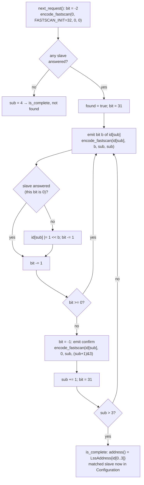

How the slave answers (`LssSlave::handle_fastscan`):

- Participates only if `node_id == UNCONFIGURED_NODE_ID` **and** state is
  `Waiting`.
- `bit_check >= FASTSCAN_INIT` (the initial probe) resets its `fs_sub` to 0 and
  answers, announcing its presence.
- Otherwise it ignores a request whose `lss_sub` is not its current `fs_sub`,
  and answers only if the checked high bits (`0xFFFF_FFFF << bit_check`) of the
  candidate equal its identity's — i.e. the pattern still matches.
- On a full match with `bit_check == 0` and a changing `lss_next`, it advances
  `fs_sub`; completing the serial sub (`lss_sub >= 3`) switches it into
  `Configuration`, exactly as a selective switch would.

The driver loop, from the source:

```rust
let mut master = FastscanMaster::new();
while let Some(req) = master.next_request() {
    let answered = /* transmit req on 0x7E5, true if identify-slave seen on 0x7E4 within timeout */;
    master.on_response(answered);
}
// master.found() && master.address() now hold the discovered identity;
// the matched node is in Configuration, ready for encode_configure_node_id(..).
```

The tests confirm convergence (`fastscan_discovers_the_address`,
`fastscan_recovers_extreme_identities` including `0xFFFF_FFFF` and mixed bit
patterns) and that two unconfigured nodes disambiguate — the master converges on
exactly one address and only that node ends up in `Configuration`.

`FastscanMaster` also has raw codec siblings: `encode_fastscan` and
`is_identify_slave_response`, cross-checked against python-canopen (see below).

---

## 9. Host transports

`canopen-host` puts I/O and file handling around the core. Everything protocol
is still the core's sans-I/O `SdoClient` — the host only supplies the bus.

### Blocking vs async SocketCAN

| | `SocketCan` (`host/src/transport.rs`) | `AsyncSocketCan` (`host/src/async_transport.rs`) |
|--|--|--|
| Feature/gate | Linux | Linux + `tokio` feature |
| Backing | `socketcan::CanSocket` | `socketcan::tokio::CanSocket` |
| I/O calls | blocking `send`/`recv` | `async` `send`/`recv` (awaited) |
| Timeout | `set_read_timeout(Duration)` | none built in — wrap in `tokio::time::timeout` |
| Helpers | `sdo_read`, `sdo_write`, `send_nmt` | same, `async` |

Both `sdo_read` / `sdo_write` run a **whole SDO transaction in one call**: they
construct an `SdoClient`, then loop — `send` the request, `recv_on` the response
COB-ID, feed it to `client.on_response`, and act on the `SdoEvent`
(`Send` → next frame, `Complete` → value, `Aborted` → `SdoError::Aborted(code)`).
`recv` skips remote/error frames and 29-bit extended IDs. Frames are built with
the core's `frame_from`/`cob_id` bridge.

**Clearer interface-open errors**: `SocketCan::open` / `AsyncSocketCan::open`
wrap the raw OS error via `open_error`, naming the interface and — when it is
missing (`ENODEV`, errno 19) — hinting `sudo ip link set up <iface>` instead of a
bare "No such device".

`SdoError` (in `transport.rs`, shared by both transports) is `Io` / `Aborted(u32)`
/ `NoValue`, with a `std::error::Error` impl.

### HeartbeatMonitor (cross-platform NMT master tooling)

`host/src/nmt.rs`'s `HeartbeatMonitor` is transport-agnostic — you feed it
`(cob_id, data, now)` and it records per-node `NodeHealth { state, last_seen }`.
It decodes only `0x700 + node` frames (node `1..=127`), and exposes
`state`, `is_alive(node, now)`, `timed_out(now)`, and `nodes()`. Because it takes
an `Instant` rather than reading a clock, it builds and tests on every platform.

### EDS parsing and codegen

`host/src/eds.rs` parses the INI-style EDS/DCF grammar: `[<index>]` and
`[<index>sub<subindex>]` sections with `ParameterName`, `DataType`, `AccessType`,
`DefaultValue`/`ParameterValue`, `PDOMapping`. It resolves `$NODEID` expressions
(`$NODEID+0x200`) against `[DeviceComissioning] NodeID` (the CiA 306 misspelling
is accepted, as is the correct one), skips unmodelled string/`DOMAIN` types
rather than failing, and maps `rwr`/`rww` access to `Rw`.
`host/src/codegen.rs`'s `generate_object_dictionary` emits fully-qualified
`canopen_rs::` Rust source so the generated file compiles regardless of the
including module's imports.

### The `canopen` CLI

`cli/src/main.rs` (binary `canopen`) offers `eds`, `codegen` (both
cross-platform), and `read`/`write`/`nmt`/`monitor` (Linux SocketCAN). The bus
subcommands are compiled into a `#[cfg(target_os = "linux")] mod bus`; on other
platforms they `bail!`. `monitor` classifies COB-IDs into NMT/SYNC/EMCY/TIME/
PDO/SDO/heartbeat/LSS ranges for readable output.

---

## 10. Testing and validation strategy

Three independent layers, all wired into CI (`.github/workflows/ci.yml`):

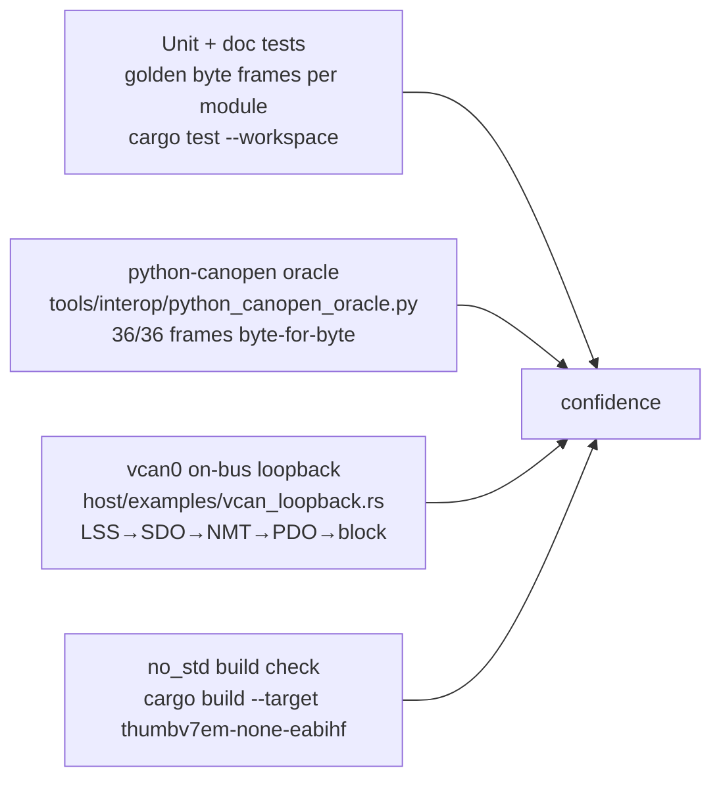

1. **Golden-byte unit tests.** Every codec module asserts encoded frames against
   hand-verified byte sequences (e.g. `download_u32_matches_known_frame` in
   `sdo/mod.rs`, `fastscan_frame_layout` in `lss.rs`), and drives the client and
   server against each other end-to-end. Doc examples in the module headers are
   compiled and run as doctests.

2. **Independent wire-format oracle.** `tools/interop/python_canopen_oracle.py`
   drives the mature [`python-canopen`](https://github.com/christiansandberg/canopen)
   library's real encoders offline and diffs its frames against canopen-rs's
   golden bytes — **36 checks, all passing** (the script counts `passed/total`
   and exits non-zero on any mismatch). Coverage spans SDO (expedited/segmented),
   NMT, EMCY, SYNC, PDO mapping values, LSS (incl. Fastscan probe and
   identify-slave), and block-transfer command bytes plus the CRC-16/XMODEM check
   value (`0x31C3` for `"123456789"`). Agreement means the wire format is correct
   against something other than this project's own reading of CiA 301.

3. **On-bus loopback over `vcan0`.** `host/examples/vcan_loopback.rs` runs a real
   device `Node` in a server thread and a master over the SocketCAN transport,
   walking the full lifecycle: LSS node-id assignment → SDO (expedited +
   segmented) → NMT start → an RPDO-in / SYNC / TPDO-out round-trip → a 50-byte
   block download the server CRC-verifies. `sudo tools/vcan_setup.sh` brings up
   the interface. (This is also the reference for how to drive block transfer by
   hand, since it is not in `Node` — see [§5c](#5c-block-transfer-high-throughput-bulk-transfer).)

4. **`no_std` guarantee.** CI builds the core for `thumbv7em-none-eabihf`, which
   fails if anything reaches for `std`. `#![deny(unsafe_code)]` keeps the core
   unsafe-free, and clippy runs with `-D warnings`.

---

## 11. Where to start reading

| To understand… | Read |
|---|---|
| The whole device runtime and frame dispatch | `core/src/node.rs` (`Node::on_frame`) |
| The output frame type and sans-I/O contract | `core/src/node.rs` (`TxFrame`) |
| The data model and access control | `core/src/object_dictionary.rs` |
| The mandatory-object baseline builder | `core/src/standard.rs` |
| Value encoding / the type system | `core/src/datatypes.rs` |
| SDO wire format and abort codes | `core/src/sdo/mod.rs` |
| Driving/serving an SDO transaction | `core/src/sdo/client.rs`, `core/src/sdo/server.rs` |
| Block transfer (codec + helpers) | `core/src/sdo/block.rs` |
| The NMT state machine | `core/src/nmt.rs` (`NmtStateMachine::apply`) |
| PDO mapping and pack/unpack | `core/src/pdo.rs` |
| LSS + Fastscan discovery | `core/src/lss.rs` (`LssSlave`, `FastscanMaster`) |
| The embedded-can bridge | `core/src/transport.rs` |
| Host SDO helpers over a bus | `host/src/transport.rs`, `host/src/async_transport.rs` |
| EDS parsing / OD codegen | `host/src/eds.rs`, `host/src/codegen.rs` |
| Heartbeat monitoring | `host/src/nmt.rs` |
| The CLI | `cli/src/main.rs` |
| End-to-end on a real bus | `host/examples/vcan_loopback.rs`, `host/examples/async_vcan.rs` |
| Wire-format cross-check | `tools/interop/python_canopen_oracle.py` |
